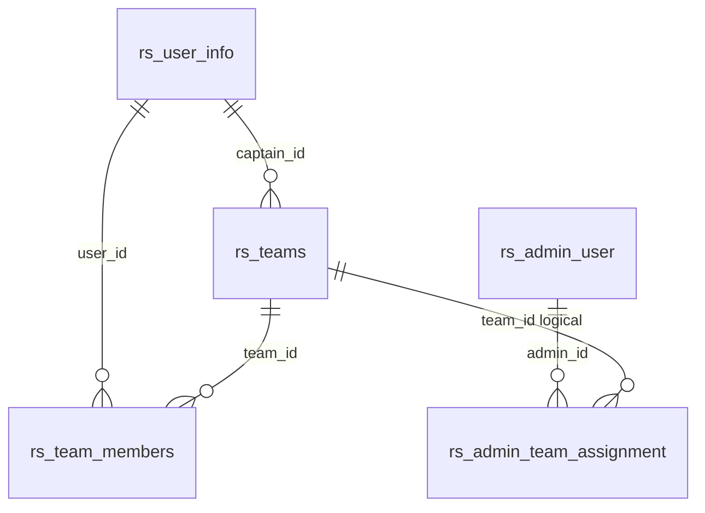
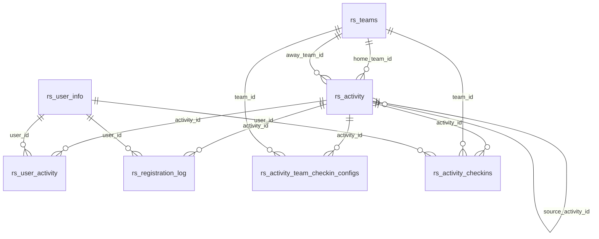
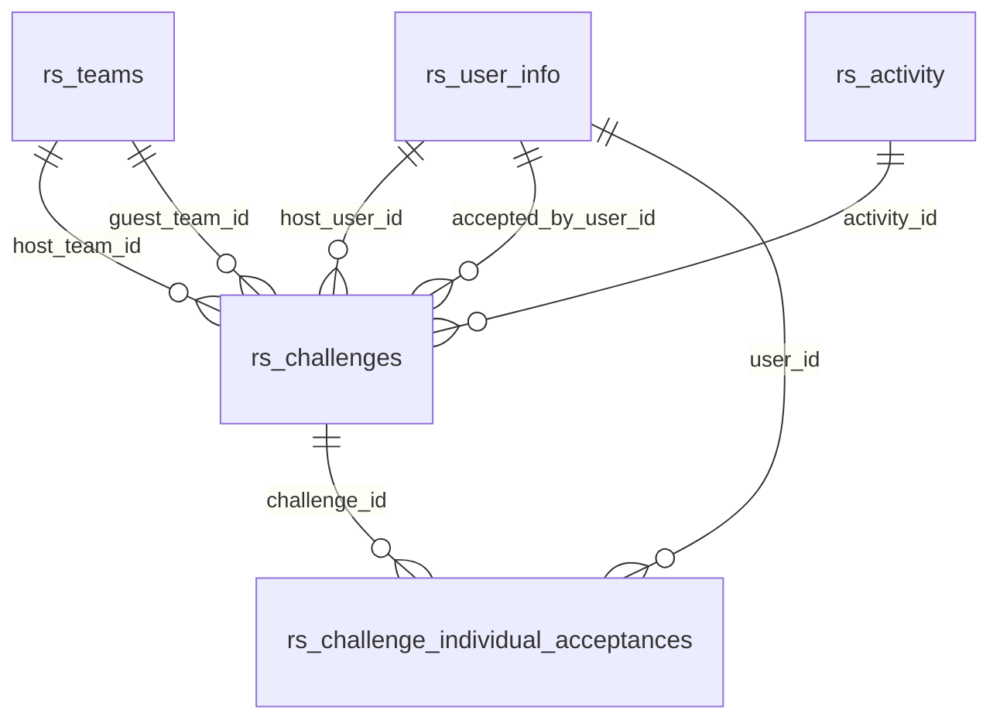
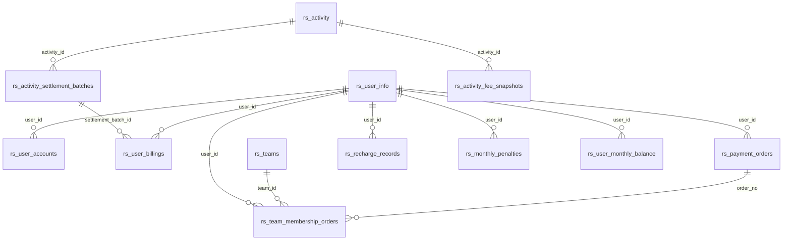
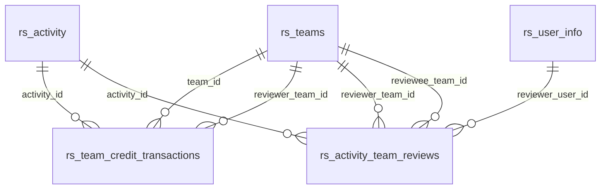

# 当前版本数据库关联关系文档

更新时间：2026-05-13

依据：`registration_system_rs/migrations/*.sql`

## 1. 总览

当前数据库为 PostgreSQL，迁移文件位于：

```text
registration_system_rs/migrations/
```

核心 ID 类型现状：

| 实体 | 主键类型 | 说明 |
| --- | --- | --- |
| 管理员 `rs_admin_user` | `BIGSERIAL` | 自增数字 |
| 用户 `rs_user_info` | `BIGSERIAL` | 自增数字 |
| 球队 `rs_teams` | `BIGINT` | 自增数字 ID，保留 `legacy_id` |
| 活动 `rs_activity` | `CHAR(36)` | 字符串 ID |
| 约队 `rs_challenges` | `CHAR(36)` | 字符串 ID |
| 多数流水表 | `BIGSERIAL` | 自增数字 |

重要决策与差异：

- 球队 ID 已完成数字化迁移：`rs_teams.id` 为 `BIGINT`，引用球队的外键列也已同步为 `BIGINT`。
- 活动 ID、约队 ID 仍保持字符串主键。
- `rs_teams.legacy_id` 保留原字符串 ID，用于迁移追踪。

## 2. 用户与管理员

### 2.1 `rs_user_info`

用户基础信息。

关键字段：

| 字段 | 类型 | 说明 |
| --- | --- | --- |
| `id` | `BIGSERIAL` | 用户 ID |
| `open_id` | `VARCHAR(128)` | 微信 openid，唯一 |
| `union_id` | `VARCHAR(128)` | 微信 unionid |
| `username` | `VARCHAR(100)` | 用户名 |
| `nickname` | `VARCHAR(100)` | 昵称 |
| `real_name` | `VARCHAR(100)` | 真实姓名 |
| `avatar_url` | `TEXT` | 头像 URL，已从 `VARCHAR(500)` 扩展 |
| `phone_number` | `VARCHAR(32)` | 手机号 |
| `status` | `SMALLINT` | 用户状态 |
| `leave_start_time` / `leave_end_time` | `TIMESTAMP` | 冻结/请假类时间窗口 |

约束和索引：

- `uk_user_open_id UNIQUE(open_id)`
- `idx_user_status`
- `idx_user_name`
- `idx_user_phone`

被引用：

- 球队队长、球队成员、活动报名、报名日志、余额账户、充值、支付订单、签到、约队、通知、球队评价等。

### 2.2 `rs_admin_user`

后台管理员。

关键字段：

| 字段 | 类型 | 说明 |
| --- | --- | --- |
| `id` | `BIGSERIAL` | 管理员 ID |
| `username` | `VARCHAR(100)` | 登录名，唯一 |
| `password_hash` | `VARCHAR(255)` | 密码哈希 |
| `nickname` | `VARCHAR(100)` | 昵称 |
| `status` | `SMALLINT` | 状态 |
| `is_super_admin` | `SMALLINT` | 是否超级管理员 |

约束和索引：

- `uk_admin_username UNIQUE(username)`
- `idx_admin_status`

被引用：

- 用户余额校准、球队信用流水、活动结算批次、队基金流水、管理员球队绑定。

## 3. 球队域

### 3.1 `rs_teams`

球队基础信息。

关键字段：

| 字段 | 类型 | 说明 |
| --- | --- | --- |
| `id` | `BIGINT` | 球队自增 ID |
| `legacy_id` | `VARCHAR(64)` | 迁移保留的历史字符串球队 ID |
| `name` | `VARCHAR(100)` | 球队名称，唯一 |
| `description` | `VARCHAR(500)` | 描述 |
| `logo_url` | `VARCHAR(500)` | Logo URL |
| `captain_id` | `BIGINT` | 队长用户 ID |
| `join_password_hash` | `VARCHAR(255)` | 入队密码哈希 |
| `status` | `SMALLINT` | 球队状态 |
| `credit_score` | `INT` | 信用分 |
| `vip_until` | `TIMESTAMP` | 会员有效期 |

外键：

- `captain_id -> rs_user_info(id)`

约束和索引：

- `uk_team_name UNIQUE(name)`
- `idx_team_captain_id`
- `idx_team_status`
- `idx_teams_credit_score`
- `idx_teams_vip_until`

### 3.2 `rs_team_members`

球队成员关系。

关键字段：

| 字段 | 类型 | 说明 |
| --- | --- | --- |
| `id` | `BIGSERIAL` | 关系 ID |
| `team_id` | `CHAR(36)` | 球队 ID |
| `user_id` | `BIGINT` | 用户 ID |
| `role` | `VARCHAR(32)` | 角色，例如 member、captain、leader、vice_captain |
| `jersey_number` | `VARCHAR(16)` | 球衣号 |
| `status` | `SMALLINT` | 成员状态 |

外键：

- `team_id -> rs_teams(id) ON DELETE CASCADE`
- `user_id -> rs_user_info(id) ON DELETE CASCADE`

约束和索引：

- `uk_team_member UNIQUE(team_id, user_id)`
- `idx_team_member_team`
- `idx_team_member_user`
- `idx_team_member_status`

### 3.3 `rs_admin_team_assignment`

后台管理员和球队绑定。

关键字段：

| 字段 | 类型 | 说明 |
| --- | --- | --- |
| `id` | `BIGSERIAL` | 绑定 ID |
| `admin_id` | `BIGINT` | 管理员 ID |
| `team_id` | `BIGINT` | 球队 ID |

约束：

- `uq_admin_team UNIQUE(admin_id, team_id)`

外键：

- `admin_id -> rs_admin_user(id) ON DELETE CASCADE`
- `team_id -> rs_teams(id) ON DELETE CASCADE`

### 3.4 球队域关系图



## 4. 活动与报名域

### 4.1 `rs_activity`

比赛/活动主表。

关键字段：

| 字段 | 类型 | 说明 |
| --- | --- | --- |
| `id` | `CHAR(36)` | 活动 ID |
| `name` | `VARCHAR(255)` | 活动名称 |
| `holding_date` | `TIMESTAMP` | 举办时间 |
| `start_time` / `end_time` | `TIMESTAMP` | 开始/结束时间 |
| `location` | `VARCHAR(255)` | 地址 |
| `location_latitude` / `location_longitude` | `DOUBLE PRECISION` | 坐标 |
| `opposing` | `VARCHAR(255)` | 对手名称 |
| `status` | `SMALLINT` | 状态 |
| `home_team_id` | `BIGINT` | 主队 |
| `away_team_id` | `BIGINT` | 客队 |
| `color` | `VARCHAR(32)` | 主队球服颜色 |
| `opposing_color` | `VARCHAR(32)` | 对手球服颜色 |
| `players_per_team` | `INT` | 人数制 |
| `match_kind` | `VARCHAR(16)` | `external` 或 `internal` |
| `source_activity_id` | `CHAR(36)` | 球队报名派生活动来源 |
| `team_registration_count` | `INT` | 球队报名人数 |

外键：

- `home_team_id -> rs_teams(id)`
- `away_team_id -> rs_teams(id)`
- `source_activity_id -> rs_activity(id) ON DELETE CASCADE`

索引：

- `idx_activity_status`
- `idx_activity_holding_date`
- `idx_activity_home_team_id`
- `idx_activity_away_team_id`
- `idx_activity_source_activity_id`
- `uk_activity_source_team`：`source_activity_id + home_team_id` 局部唯一

### 4.2 `rs_user_activity`

用户活动报名记录。

关键字段：

| 字段 | 类型 | 说明 |
| --- | --- | --- |
| `id` | `BIGSERIAL` | 报名 ID |
| `activity_id` | `CHAR(36)` | 活动 ID |
| `user_id` | `BIGINT` | 用户 ID |
| `stand` | `SMALLINT` | 报名状态 |
| `registration_count` | `INT` | 报名人数或占位数 |
| `paid` | `SMALLINT` | 支付状态 |
| `operation_time` | `TIMESTAMP` | 操作时间 |

外键：

- `activity_id -> rs_activity(id) ON DELETE CASCADE`
- `user_id -> rs_user_info(id) ON DELETE CASCADE`

约束和索引：

- `uk_activity_user UNIQUE(activity_id, user_id)`
- `idx_user_activity_user`
- `idx_user_activity_stand`

当前 stand 约定由应用层解释，管理端 service 中标签为：

- `0` 未表态
- `1` 参加
- `2` 请假
- `3` 迟到

### 4.3 `rs_registration_log`

报名变更日志。

外键：

- `activity_id -> rs_activity(id) ON DELETE CASCADE`
- `user_id -> rs_user_info(id) ON DELETE CASCADE`

用途：

- 记录报名状态变化历史。

### 4.4 活动签到表

#### `rs_activity_team_checkin_configs`

活动按球队维度的签到配置。

主键：

- `(activity_id, team_id)`

外键：

- `activity_id -> rs_activity(id) ON DELETE CASCADE`
- `team_id -> rs_teams(id) ON DELETE CASCADE`
- `updated_by_user_id -> rs_user_info(id) ON DELETE SET NULL`

字段：

- `enabled`
- `radius_meters`
- `open_minutes_before`
- `close_minutes_after`

#### `rs_activity_checkins`

签到记录。

外键：

- `activity_id -> rs_activity(id) ON DELETE CASCADE`
- `team_id -> rs_teams(id) ON DELETE CASCADE`
- `user_id -> rs_user_info(id) ON DELETE CASCADE`

约束：

- `uq_activity_checkins UNIQUE(activity_id, team_id, user_id)`

### 4.5 活动域关系图



## 5. 约队域

### 5.1 `rs_challenges`

约队主表。

关键字段：

| 字段 | 类型 | 说明 |
| --- | --- | --- |
| `id` | `CHAR(36)` | 约队 ID |
| `title` | `VARCHAR(120)` | 标题 |
| `kind` | `VARCHAR(20)` | `team` 或 `individual` |
| `host_team_id` | `BIGINT` | 发起球队 |
| `host_user_id` | `BIGINT` | 发起人 |
| `guest_team_id` | `BIGINT` | 接约球队 |
| `accepted_by_user_id` | `BIGINT` | 接约人 |
| `activity_id` | `CHAR(36)` | 关联生成的活动 |
| `holding_date` | `TIMESTAMP` | 约队时间 |
| `players_per_team` | `INT` | 人数制 |
| `fee_per_person` | `DECIMAL(10,2)` | 人均费用 |
| `status` | `VARCHAR(20)` | open、matched、cancelled |

外键：

- `host_team_id -> rs_teams(id) ON DELETE CASCADE`
- `host_user_id -> rs_user_info(id) ON DELETE CASCADE`
- `guest_team_id -> rs_teams(id) ON DELETE SET NULL`
- `accepted_by_user_id -> rs_user_info(id) ON DELETE SET NULL`
- `activity_id -> rs_activity(id) ON DELETE SET NULL`

约束：

- `ck_challenges_status CHECK status IN ('open','matched','cancelled')`
- `ck_challenges_teams_not_same`
- `ck_challenges_kind CHECK kind IN ('team','individual')`

### 5.2 `rs_challenge_individual_acceptances`

散人约队参与记录。

外键：

- `challenge_id -> rs_challenges(id) ON DELETE CASCADE`
- `user_id -> rs_user_info(id) ON DELETE CASCADE`

约束：

- `uq_challenge_individual_acceptance UNIQUE(challenge_id, user_id)`

### 5.3 约队域关系图



## 6. 账单、账户与支付

### 6.1 `rs_user_accounts`

用户余额账户。

外键：

- `user_id -> rs_user_info(id) ON DELETE CASCADE`

约束：

- `uk_user_accounts_user UNIQUE(user_id)`

字段：

- `balance`
- `total_recharge`
- `total_expense`
- `total_penalty`
- `version`
- `status`

### 6.2 `rs_user_billings`

用户账单记录。

关键字段：

| 字段 | 类型 | 说明 |
| --- | --- | --- |
| `id` | `BIGSERIAL` | 账单 ID |
| `user_id` | `BIGINT` | 用户 |
| `activity_id` | `CHAR(36)` | 活动 ID |
| `fee` | `DECIMAL(10,2)` | 金额 |
| `billing_type` | `VARCHAR(32)` | 类型 |
| `billing_date` | `DATE` | 账单日期 |
| `settlement_batch_id` | `BIGINT` | 结算批次 |

外键：

- `user_id -> rs_user_info(id) ON DELETE CASCADE`
- `activity_id -> rs_activity(id) ON DELETE RESTRICT`
- `settlement_batch_id -> rs_activity_settlement_batches(id)`

注意：

- `activity_id` 有索引，并已声明到 `rs_activity(id)` 的外键。

### 6.3 `rs_activity_settlement_batches`

活动结算批次。

外键：

- `activity_id -> rs_activity(id) ON DELETE CASCADE`
- `reversal_of_batch_id -> rs_activity_settlement_batches(id)`
- `created_by_admin_id -> rs_admin_user(id)`

约束：

- `uk_activity_settlement_batch UNIQUE(activity_id, batch_no)`

字段：

- `operation_type`
- `settlement_mode`：`aa` 或 `manual`
- `participant_scope`：`registered_attendees` 或 `custom_users`
- `total_amount`
- `aa_fee`
- `user_count`

### 6.4 `rs_payment_orders`

微信支付订单。

外键：

- `user_id -> rs_user_info(id) ON DELETE CASCADE`

约束：

- `uk_payment_orders_order_no UNIQUE(order_no)`

字段：

- `amount`
- `payment_type`
- `status`
- `prepay_id`
- `transaction_id`
- `paid_at`
- `cancelled_at`

### 6.5 `rs_team_membership_orders`

球队会员订单。

外键：

- `order_no -> rs_payment_orders(order_no) ON DELETE CASCADE`
- `team_id -> rs_teams(id) ON DELETE CASCADE`
- `user_id -> rs_user_info(id) ON DELETE CASCADE`

### 6.6 其他账务表

| 表 | 用途 |
| --- | --- |
| `rs_activity_fee_snapshots` | 活动费用快照，记录活动结算或手工保存的费用描述、单人费用和人数，`activity_id` 唯一 |
| `rs_user_balance_adjustments` | 用户余额校准 |
| `rs_monthly_penalties` | 月度处罚 |
| `rs_recharge_records` | 充值记录 |
| `rs_user_monthly_balance` | 用户月度余额汇总 |
| `rs_team_fund_account` | 队基金账户 |
| `rs_team_fund_transactions` | 队基金流水 |

### 6.7 账务关系图



## 7. 球队信用与互评

### 7.1 `rs_team_credit_transactions`

球队信用流水。

外键：

- `team_id -> rs_teams(id) ON DELETE CASCADE`
- `activity_id -> rs_activity(id) ON DELETE SET NULL`
- `reviewer_team_id -> rs_teams(id) ON DELETE SET NULL`
- `created_by_user_id -> rs_user_info(id) ON DELETE SET NULL`
- `created_by_admin_id -> rs_admin_user(id) ON DELETE SET NULL`

用途：

- 记录信用分变化、会员充值、评价、处罚等。

### 7.2 `rs_activity_team_reviews`

赛后球队互评。

外键：

- `activity_id -> rs_activity(id) ON DELETE CASCADE`
- `reviewer_team_id -> rs_teams(id) ON DELETE CASCADE`
- `reviewee_team_id -> rs_teams(id) ON DELETE CASCADE`
- `reviewer_user_id -> rs_user_info(id) ON DELETE CASCADE`

约束：

- `uk_activity_team_reviews UNIQUE(activity_id, reviewer_team_id)`
- `rating BETWEEN 1 AND 5`
- `reviewer_team_id <> reviewee_team_id`

关系图：



## 8. 通知与系统配置

### 8.1 `rs_user_notifications`

用户通知。

外键：

- `user_id -> rs_user_info(id) ON DELETE CASCADE`

字段：

- `kind`
- `title`
- `content`
- `related_type`
- `related_id`
- `read_at`

### 8.2 `rs_system_map_settings`

地图配置单例表。

主键和约束：

- `id SMALLINT PRIMARY KEY`
- `CHECK(id = 1)`
- `selected_provider IN ('tencent','amap')`

用途：

- 保存腾讯/高德地图 key、secret、base url。

### 8.3 `rs_system_runtime_configs`

系统运行配置。

主键：

- `config_key VARCHAR(64)`

字段：

- `config_value JSONB`

当前默认配置：

- `mini_app`

用于控制：

- 首页比赛卡片数量。
- 首页约队数量。
- 活动拉取 page size。
- 比赛详情相关活动数量。
- 参与头像展示数量。
- 签到默认半径和时间窗口。
- 支付订单数量。
- 通知列表数量。

## 9. 主要跨域关联

| 源表 | 目标表 | 关系 |
| --- | --- | --- |
| `rs_team_members.user_id` | `rs_user_info.id` | 用户加入球队 |
| `rs_team_members.team_id` | `rs_teams.id` | 球队拥有成员 |
| `rs_activity.home_team_id` | `rs_teams.id` | 活动主队 |
| `rs_activity.away_team_id` | `rs_teams.id` | 活动客队 |
| `rs_user_activity.activity_id` | `rs_activity.id` | 用户报名活动 |
| `rs_user_activity.user_id` | `rs_user_info.id` | 用户报名记录 |
| `rs_challenges.host_team_id` | `rs_teams.id` | 约队发起球队 |
| `rs_challenges.activity_id` | `rs_activity.id` | 约队生成活动 |
| `rs_activity_settlement_batches.activity_id` | `rs_activity.id` | 活动结算 |
| `rs_user_billings.settlement_batch_id` | `rs_activity_settlement_batches.id` | 账单属于结算批次 |
| `rs_payment_orders.user_id` | `rs_user_info.id` | 用户支付订单 |
| `rs_team_membership_orders.order_no` | `rs_payment_orders.order_no` | 会员订单绑定支付订单 |

## 10. 当前 schema 风险和建议

### 10.1 球队 ID 数字化迁移已完成

当前状态：

- `rs_teams.id` 已改为 `BIGINT`。
- `rs_team_members`、`rs_activity`、`rs_challenges`、`rs_activity_checkins`、`rs_team_credit_transactions`、`rs_team_membership_orders`、`rs_admin_team_assignment` 等球队引用列已同步改为 `BIGINT`。
- `rs_teams.legacy_id` 保留原字符串 ID。

### 10.2 `rs_admin_team_assignment` 外键已补齐

当前状态：

- `admin_id` 与 `team_id` 都已具备显式外键。
- `team_id` 与 `rs_teams.id` 类型一致，均为 `BIGINT`。

### 10.3 `rs_user_billings.activity_id` 活动外键已补齐

当前状态：

- `activity_id` 为活动字符串 ID。
- 已定义 `FOREIGN KEY activity_id REFERENCES rs_activity(id)`。

建议：

- 若历史数据干净，可补外键。
- 若历史数据不干净，先清洗账单数据，再补约束。

### 10.4 账务模型仍需产品化

现状：

- 已有余额、账单、结算批次、支付订单、会员订单等表。
- 退款、撤销、审计、余额不足、重复结算策略未完整落表。

建议：

- 重写 billing 前先出财务领域模型。
- 明确流水不可变、冲正、订单和账单之间的关系。

### 10.5 图片字段与存储策略

现状：

- `rs_user_info.avatar_url` 是 `TEXT`。
- `rs_teams.logo_url` 仍是 `VARCHAR(500)`。

建议：

- 如果所有图片都使用 MinIO/CDN URL，`logo_url`、未来 `cover` 等字段也应评估是否扩为 `TEXT`。
- 统一对象 key 命名规范和迁移策略。
